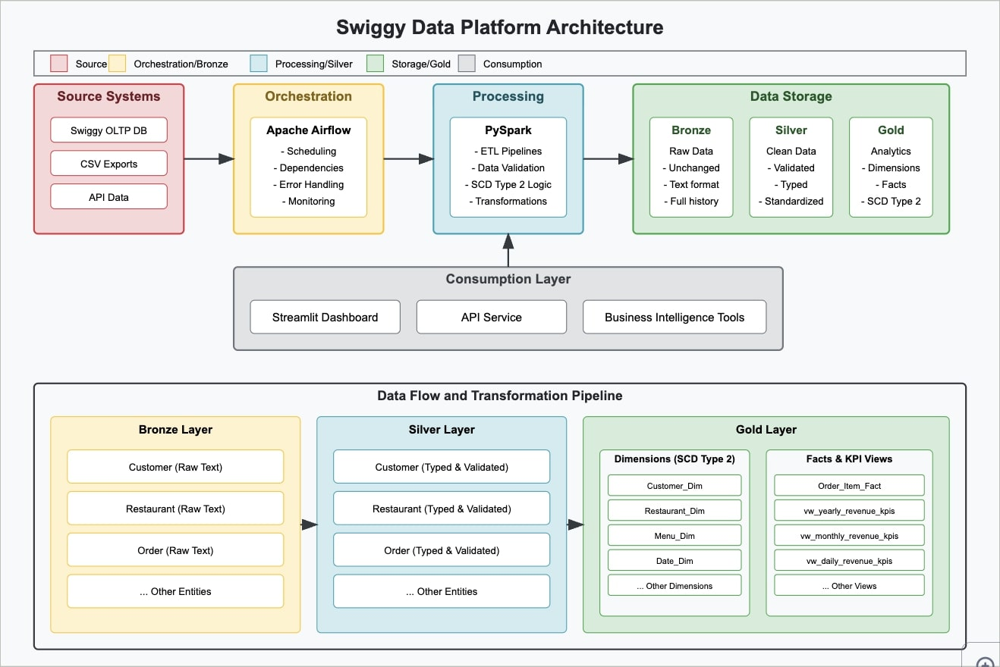
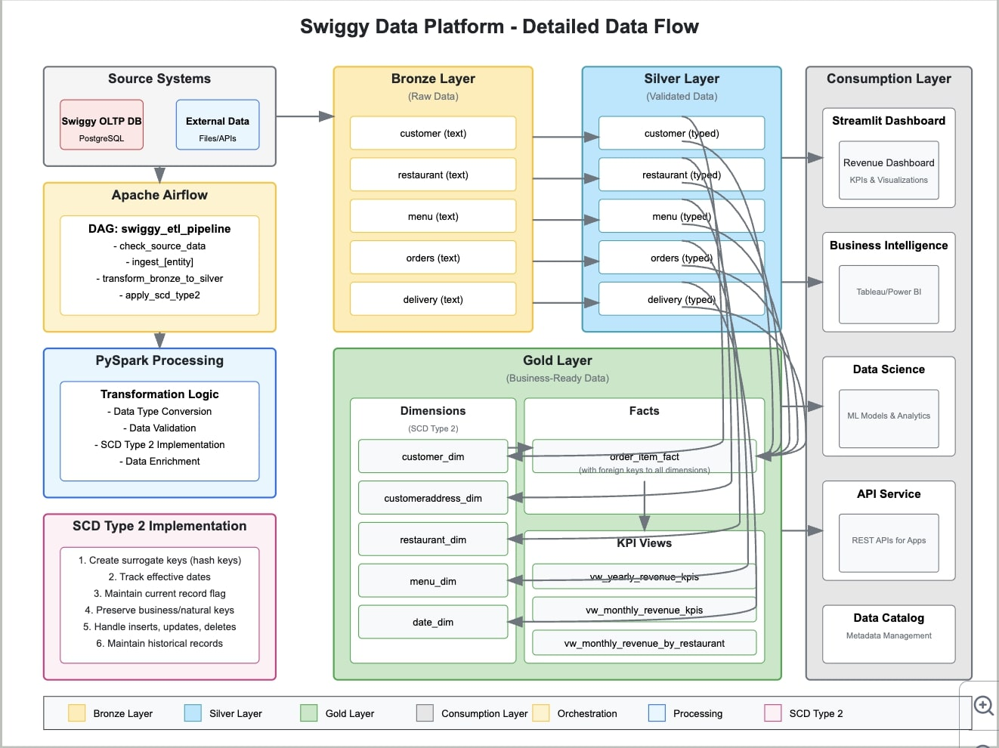
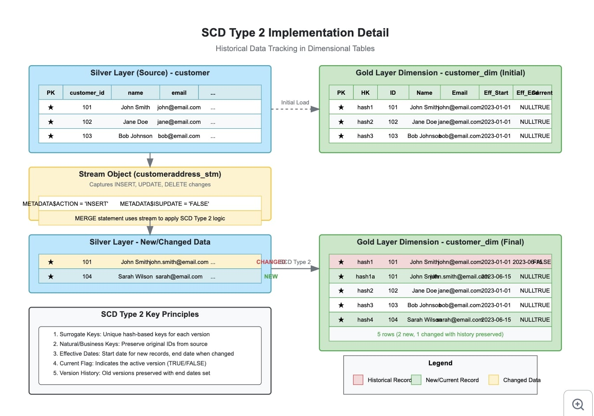
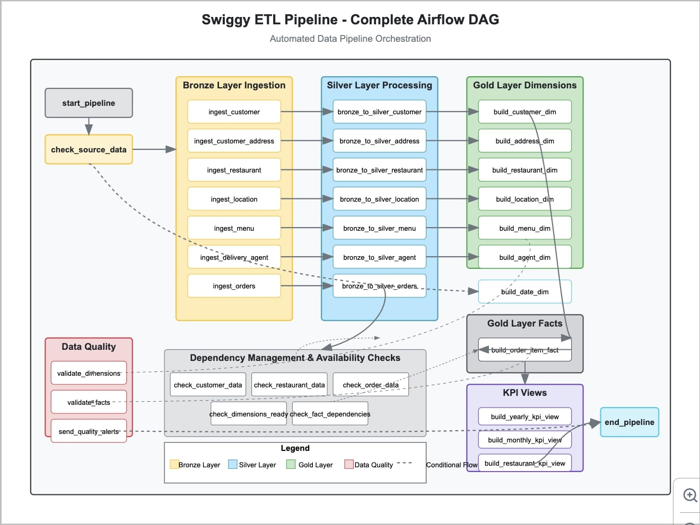

# Swiggy Data Platform Architecture Design

Based on your Swiggy analytics project and questions, I'll help design a comprehensive modern data platform that automates the ETL processes you've been doing manually in Snowflake. Let's break this down into key components and concepts.



## 1. Understanding Multi-Layer Data Architecture (Medallion Architecture)

The medallion architecture (Bronze/Silver/Gold or Raw/Clean/Consumption) serves specific purposes:

### Bronze Layer (Raw/Stage)



- **Purpose**: Data preservation in original form
- **Characteristics**: 
  - Unmodified source data (maintains exact copy of source)
  - No data type conversions, validations, or business rules
  - Quick ingestion with minimal transformations
  - Complete audit trail of all received data
  - All columns typically stored as strings/text to prevent load failures

### Silver Layer (Clean)
- **Purpose**: Data standardization and enrichment
- **Characteristics**:
  - Proper data types applied
  - Basic validations and business rules
  - Duplicate removal and data cleansing
  - Standardized naming conventions
  - Format standardization (dates, numbers, etc.)
  - Single source of truth for each entity

### Gold Layer (Consumption)
- **Purpose**: Business-ready analytical data
- **Characteristics**:
  - Dimensional models (facts and dimensions)
  - Aggregated metrics and KPIs
  - Historical tracking via SCD Type 2
  - Pre-computed business metrics
  - Optimized for analytics workloads
  - Serves dashboards, reports, and data science

### Why Three Layers ?
The separation provides:
1. **Risk mitigation**: Raw data is preserved for recovery/audit
2. **Separation of concerns**: Data engineers work on Silver, analysts on Gold
3. **Performance optimization**: Each layer is optimized for different workloads
4. **Evolution flexibility**: Silver layer can change schema without affecting raw storage or business logic

## 2. Understanding SCD Type 2 Implementation



SCD Type 2 (Slowly Changing Dimension) is used to track historical changes in dimension tables.

### Key Components:
1. **Surrogate Keys**: System-generated unique identifiers (like your CUSTOMER_HK in customer_dim)
2. **Natural/Business Keys**: Original identifiers from source systems (CUSTOMER_ID)
3. **Effective Dates**: 
   - `EFF_START_DATE`: When the record became valid
   - `EFF_END_DATE`: When the record became invalid (NULL for current version)
4. **Current Flag**: Boolean indicator showing if record is current version

### How SCD Type 2 Works:
1. When a new record arrives: Insert with current date as start date, NULL as end date, TRUE as current flag
2. When an existing record changes:
   - Set end date and current flag = FALSE for existing record
   - Insert new record with current date as start date, NULL as end date, TRUE as current flag
3. When a record is deleted:
   - Set end date and current flag = FALSE (logical delete)

### Implementation in Your Project:
Your queries use MERGE statements with logic that:
1. Creates hash keys for surrogate keys (CUSTOMER_HK, RESTAURANT_HK, etc.)
2. Manages effective dates and current flags
3. Uses stream objects to detect changes and perform the right operations

## 3. Dimension vs. Fact Tables

### Dimension Tables
- **Purpose**: Provide context and descriptive attributes
- **Characteristics**:
  - Relatively small with many columns
  - Descriptive textual attributes
  - Changes less frequently (hence SCD Type 2)
  - Examples in your project: customer_dim, restaurant_dim, delivery_agent_dim, menu_dim, date_dim

### Fact Tables
- **Purpose**: Store performance measures and metrics
- **Characteristics**:
  - Large with fewer columns
  - Numerical values/measures (quantity, price, subtotal)
  - Foreign keys to dimension tables
  - Rapidly growing
  - Example in your project: order_item_fact

### Relationship Between Facts and Dimensions:
- Fact tables contain foreign keys to all related dimension tables
- Dimensions provide the "who, what, where, when, why, and how" context to the facts
- Together they form a "star schema" that allows slicing and analyzing data across multiple dimensions

## 4. Automated Data Platform Design

Let's design an automated system for Swiggy that replaces your manual workflow:

### High-Level Architecture:



```
Source Systems → Apache Airflow → Data Lake (Raw) → PySpark ETL → Snowflake DWH → Streamlit Dashboard
```

### Detailed Components:

#### 1. Data Sources
- APIs, databases, files, streaming sources from Swiggy's operational systems
- Scheduled exports or change data capture from source systems

#### 2. Orchestration Layer (Apache Airflow)
- Manages scheduling, dependencies, and workflow
- Monitors data availability across source systems
- Handles retries and failure notifications
- Tracks data lineage and pipeline metadata

#### 3. Data Storage
- **Landing Zone**: Raw files from source systems
- **Data Lake**: Organized by entity and date partitions
- **Data Warehouse**: Snowflake with stage/clean/consumption schemas

#### 4. Processing Layer (PySpark)
- **Bronze to Silver**: Data validation, cleansing, and type conversion
- **Silver to Gold**: Dimensional modeling with SCD Type 2
- **Stream Processing**: For real-time updates if needed

#### 5. Serving Layer
- **KPI Views**: Materialized views for common analytics
- **Streamlit Dashboard**: Business intelligence interface
- **API Layer**: For programmatic access

## 5. PySpark Implementation Approach

To replicate your Snowflake SQL logic in PySpark:

### Bronze to Silver Transformation:
```python
# Simplified PySpark logic for bronze to silver transformation
def transform_bronze_to_silver(entity_name, date_partition):
    # Read from bronze layer
    bronze_df = spark.read.format("parquet").load(f"s3://bronze/{entity_name}/{date_partition}")
    
    # Apply data type conversions
    silver_df = bronze_df.withColumn("customer_id", col("customerid").cast("integer"))
                         .withColumn("name", col("name").cast("string"))
                         # other transformations...
    
    # Write to silver layer
    silver_df.write.format("delta").mode("overwrite").option("mergeSchema", "true")\
             .save(f"s3://silver/{entity_name}")
```

### Silver to Gold with SCD Type 2:
```python
# Simplified PySpark logic for SCD Type 2 implementation
def apply_scd_type2(entity_name, date_partition):
    # Read current silver data
    silver_df = spark.read.format("delta").load(f"s3://silver/{entity_name}")
    
    # Read existing gold dimension
    gold_df = spark.read.format("delta").load(f"s3://gold/{entity_name}_dim")
    
    # Generate hash key for new records
    silver_df = silver_df.withColumn("hash_key", 
                                    sha2(concat_ws("", col("id"), col("name"), ...), 256))
    
    # Identify new and changed records
    joined_df = silver_df.join(gold_df, ["business_key"], "outer")
                        .where((gold_df.hash_key != silver_df.hash_key) | 
                               gold_df.hash_key.isNull())
    
    # Close existing records (set end date and current flag)
    updates = joined_df.where(gold_df.hash_key.isNotNull())\
                      .select(gold_df.surrogate_key,
                              lit(current_date()).alias("eff_end_date"),
                              lit(False).alias("is_current"))
    
    # Insert new versions
    inserts = silver_df.select(
        col("hash_key").alias("surrogate_key"),
        col("id").alias("business_key"),
        # other columns...
        lit(current_date()).alias("eff_start_date"),
        lit(None).alias("eff_end_date"),
        lit(True).alias("is_current")
    )
    
    # Apply updates and inserts
    # Using Delta Lake merge operation
```

## 6. Airflow DAG Design

An effective DAG structure for your Swiggy data pipeline:

### Main dag.py:
```python
# Conceptual Airflow DAG structure
with DAG('swiggy_etl_pipeline', schedule_interval='0 1 * * *') as dag:
    
    # Check for new data in source systems
    check_source_data = PythonOperator(
        task_id='check_source_data',
        python_callable=check_data_availability
    )
    
    # Ingest data to bronze layer
    ingest_customer = PythonOperator(
        task_id='ingest_customer',
        python_callable=ingest_entity_to_bronze,
        op_kwargs={'entity': 'customer'}
    )
    
    # Transform to silver layer
    bronze_to_silver_customer = PythonOperator(
        task_id='bronze_to_silver_customer',
        python_callable=transform_bronze_to_silver,
        op_kwargs={'entity': 'customer'}
    )
    
    # Transform to gold layer
    silver_to_gold_customer = PythonOperator(
        task_id='silver_to_gold_customer',
        python_callable=apply_scd_type2,
        op_kwargs={'entity': 'customer', 'dimension': 'customer_dim'}
    )
    
    # Similar operators for other entities...
    
    # Build fact table after all dimensions are ready
    build_order_item_fact = PythonOperator(
        task_id='build_order_item_fact',
        python_callable=build_fact_table
    )
    
    # Generate KPI views
    generate_kpi_views = PythonOperator(
        task_id='generate_kpi_views',
        python_callable=generate_kpi_views
    )
    
    # Set dependencies
    check_source_data >> ingest_customer >> bronze_to_silver_customer >> silver_to_gold_customer
    [silver_to_gold_customer, silver_to_gold_restaurant, ...] >> build_order_item_fact >> generate_kpi_views
```

## 7. Handling Data Availability Challenges

For the scenario you mentioned (customer data arriving but order data missing):

### Approaches:
1. **Dependency-Based Processing**:
   - Configure Airflow DAG to enforce entity dependencies
   - Only trigger fact table generation when all required dimensions are updated
   - Use sensor tasks to wait for data availability

2. **Incremental Processing**:
   - Process each entity independently up to the silver layer
   - Only build gold layer facts when all required dimensions are available
   - Maintain "data availability" metadata table

3. **Intelligent Data Validation**:
   - Use Great Expectations or similar libraries to validate data completeness
   - Create a validation layer between bronze and silver to check for required related entities
   - Implement conditional logic to handle missing related records

### Sample Implementation:
```python
def check_entity_availability(date_partition):
    """Check if all required entities are available for fact table processing"""
    entities = ['customer', 'restaurant', 'menu', 'order', 'delivery_agent']
    missing = []
    
    for entity in entities:
        if not check_data_exists(f"s3://silver/{entity}/{date_partition}"):
            missing.append(entity)
    
    if missing:
        logging.warning(f"Cannot build fact table - missing entities: {missing}")
        return False
    return True

# In Airflow DAG
build_fact = PythonOperator(
    task_id='build_order_item_fact',
    python_callable=build_fact_table,
    op_kwargs={'date_partition': '{{ ds }}'},
    trigger_rule=TriggerRule.ALL_SUCCESS  # Only run if all upstream tasks succeed
)
```

## 8. Using Snowflake with PySpark and Airflow

You can integrate Snowflake into your PySpark/Airflow pipeline using:

### Option 1: Snowflake Connector for Spark
```python
# Writing to Snowflake from PySpark
def write_to_snowflake(df, table_name, schema="CLEAN_SCH"):
    df.write \
        .format("snowflake") \
        .options(**snowflake_options) \
        .option("dbtable", f"{schema}.{table_name}") \
        .mode("append") \
        .save()
```

### Option 2: Snowflake Data Ingestion from S3/Azure/GCP
```python
# Execute Snowflake COPY command via Airflow
def load_to_snowflake(entity, stage_name, table_name):
    snowflake_hook = SnowflakeHook(snowflake_conn_id='snowflake_conn')
    
    sql = f"""
    COPY INTO {table_name}
    FROM @{stage_name}/{entity}/
    FILE_FORMAT = (FORMAT_NAME = 'CSV_FILE_FORMAT')
    PATTERN = '.*{entity}_.*.csv'
    """
    
    snowflake_hook.run(sql)
```

### Option 3: Snowflake Stored Procedures
- Encapsulate your SCD Type 2 logic in Snowflake stored procedures
- Call these procedures from Airflow
- Let Snowflake handle complex merges for performance

## Conclusion and Next Steps

This system design provides an automated, scalable approach to replace your manual ETL process for Swiggy's data warehouse. The architecture leverages:

1. **Medallion Architecture** for clean separation of concerns
2. **PySpark** for scalable processing
3. **Airflow** for orchestration
4. **Snowflake** for data warehousing
5. **SCD Type 2** for historical tracking
6. **Star Schema** for analytics optimization

### Next Steps:
1. Define entity dependencies and processing order
2. Create metadata management system to track data freshness
3. Implement data quality checks at each layer
4. Set up monitoring and alerting for pipeline health
5. Design incremental processing logic to handle late-arriving data

This design maintains the core functionality of your current Snowflake implementation while adding automation, scalability, and resilience to handle real-world data challenges.


## SCD Type 2

- The main characteristics of Slowly C

## Medllion Arcitecture

## Delta Lake

## Data Warehouse Model